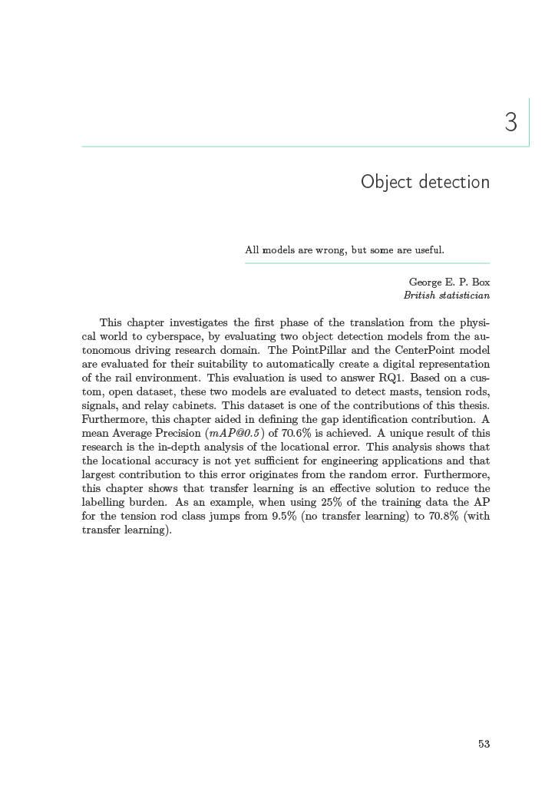

# PhD thesis
This thesis makes use of the [memoir class](https://ctan.org/pkg/memoir) for typesetting the document. The title pages are typeset according to the guidelines of the University of Twente.

Two sample pages from the thesis are provided below. The entire thesis can be found here: [doi:10.3990/1.9789036561990](https://doi.org/10.3990/1.9789036561990).

Chapter heading            |  Regular page
:-------------------------:|:-------------------------:
  |  

Some remarks about the thesis:

* Whilst adjusting the colours of the chapter headings lines, it also changed the colours of the rules used in the tables. I thought it looked nice, so I kept it.
* The file `license-lit.dbx` enables a custom field `licence` for the bibliography. This information is used in the publication overview.
* Install the [cm-super](https://ctan.org/pkg/cm-super) to have crisp vector fonts when using the T1 font encoding option.
* Tip: Use TikZ for making plots, this makes it easy to match colours later on.

# References
References can be a nightmare to get right, so here are some useful tips.

## Export only used references
During the course of my PhD I collected several bib files for each publication. They also contained a lot of unused references. To obtain a list of references which are actually used in the thesis we can use the `biber` command.

``` bash
biber mythesis --output-format=bibtex --output-fieldcase=lower -O only_references_in_use.bib
```

This saves a lot of work when manually going through the references to check and update their information.

## Use biblatex to its full extend
[biblatex](https://ctan.org/pkg/biblatex) is awesome, so use it. It introduces some new entry types and fields. For instance, a conference can be given a date range using the `date` field, e.g. `date = {2024-07-24/2024-07-26}`. I had the habit of hard coding the *et al.* part of a reference by hand. Don't. The dot after *et al* will be typeset by a double space in LaTeX. Use the proper `\citeauthor{}` instead, which also provides more flexibility in the long run. 


# Acknowledgements
The [PhD thesis template](https://github.com/jacob-kamminga/PhD-Dissertation-template-UTwente) by Jacob has been a frequent reference source during the early stages of drafting my thesis.
